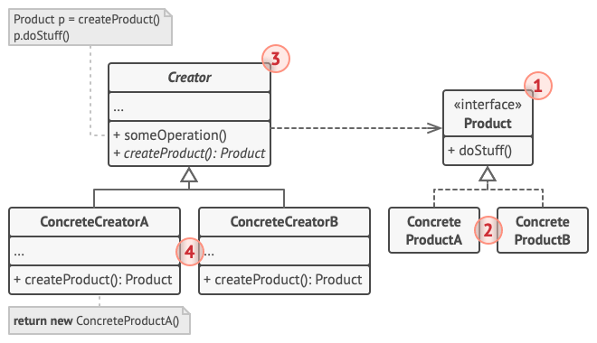
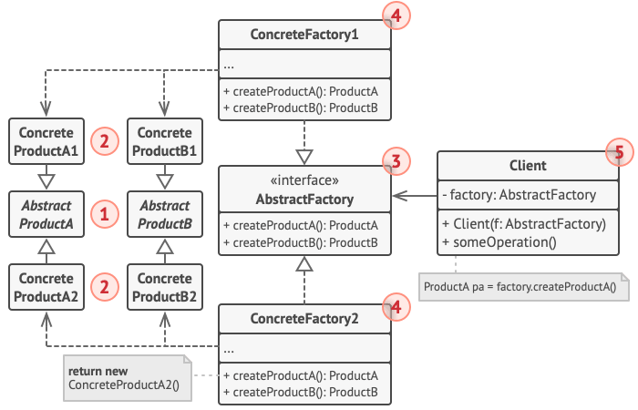
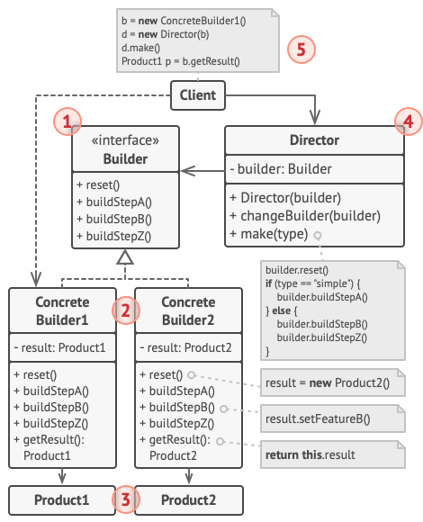
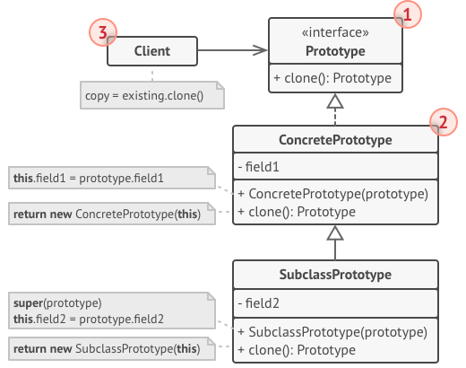

# Creational patterns
Creational design patterns provide various object creation mechanisms, which increase flexibility and reuse of existing code.

- how are objects created
- inheritance

## Factory Method
(Virtual constructor)
creational design pattern that provides an interface for creating objects in a superclass, but allows subclasses to alter the type of objects that will be created.

### About
- (Virtual constructor)
- replace the direct object construction

### Examples
- orders system -> notification
- Logistic center - different transportations

### Structure

Product
- declares the interface

Concrete Product
- different implementation of the product interface

Creator (Factory)
- declares the factory method -> returns new objects

Concrete Creators
- override the base factory method 

### Usage
- a class wants its subclasses to specify the objects it creates
- classes delegate responsibility to one of several helper subclasses, and you want to localize the knowledge of which helper subclass is the delegate

### Advantages
- Open/Closed principle
- Single-responsibility principle
- flexible
- lowers coupling
- Encapsulations
- Testing -> Mock objects

### Disadvantages
- complexity -> too many classes
- code duplication
- needs inheritance

### Related patterns
- Abstract Factory
- Template Method
- Prototype

## Abstract Factory (Kit)
creational design pattern that lets you produce families of related objects without specifying their concrete classes.

### About
- to create set of related products
- better configurations
- better extendability
- testability

### Example
- Furniture shop 
- cross-platform UI

### Structure
AbstractFactory
- declare interfaces for a set of distinct but related products which make up a product family

ConcereteFactory
- implement creation methods of the abstract factory
- Each corresponds to a specific variant of products and creates only those product variants

AbstractProduct
- declare interfaces for a set of distinct but related products which make up a product family

ConcreteProduct
- various implementations of abstract products, grouped by variants
- Each abstract product (chair/sofa) must be implemented in all given variants (Victorian/Modern)

Client
- can work with any factory/product variant through the interfaces

### Usage
- games
- UI komponents
- database connectors
- sw configuration (lokalization)
- plugin systems
- cloud and distributed systems

### Advantages
- specific classes isolations - better coupling
- easy to change products families
- Open/Closed Principle
- consistency
- Single Responsibility Principle

### Disadvantages
- code complexity - a lot of classes and interfaces
- not good for smaller projects
- complex factory extentions

### Related patterns
- Prototype
- Factory Method
- Singleton

## Builder
Separate the construction of a complex object from its representation so that the same construction process can create different representations.

### About
- separation of constrution 
- construction complex objects step by step
- gets rid of "telescoping constructor"
- for creating different representation of some product (wooden and stone house)

### Example
- House with different variants

### Structure

Builder
- declares product construction steps that are common to all types of builders

Concrete Builder
- provide different implementations of the construction steps
- may produce products that don’t follow the common interface.

Director
- defines the order of constructions steps and configuration

Product
- resulting objects 

### Advantages
- better control of the creation process
- immutability
- fluent syntax
- easily extandable
- can set default values
- Single Responsibility Principle - contruction is isolated from business logic

### Disadvantages
- code can be repetetive
- every Products has to have different ConcreteBuilder

### Related patterns
- Abstract Factory
- Composite
- Prototype

## Prototype
Copying existing objects without making code dependent on their classes

### Motivation
- Graphic editor -> tools

### About
- copying the object from inside
- cloning - like cells in nature
- client is independent on products
    - doesnt know its inner structure

### Structure
Client
- can produce a copy of any object that follows the interface

Prototype (Inteface) 
- declares the cloning method

ConcretePrototype
- implements the cloning method
- 

### Usage
- Unity Game Engine - Prefabs
- Java Standard Library
- C# - System.ICloneable

### Advanteges
- get rid of repeatin initialization code
- simplier production of complex objects
- alternative to inheritance

### Disadvantages
- cloning complex objects with circular dependencies might be very tricky

### Related patterns
- Singleton
- Composite
- Abstract Factory

## Singleton
Creational design pattern that lets you ensure that a class has only one instance, while providing a global access point to this instance.

### About
- antipattern
- to get only one instance (like printer queue)
- global access point
- static class -> cant add sth in parameters and inheritance

### Example

### Structure

Client

Singleton
- getInstance method
- hides the constructor

### Usage
- logger
- database connections
- cache
- app configuration
- ThreadPools

### Implementation 
- Mayers singleton (C++ 11)

### Problems
- destructor -> when?
    - order
    - memory leak

- Ostrich singleton - dont care abour destruction

### Advantages
- global access point with lazy initialization
- better than global variable
- inheritance

### Disadvantages
- lifespan
- testability
- hidden dependencies/coupling
- only for specific usecases
- Violates the Single Responsibility Principle. The pattern solves two problems at the time.

### Related patterns
- Abstract Factory
- builder
- Facade