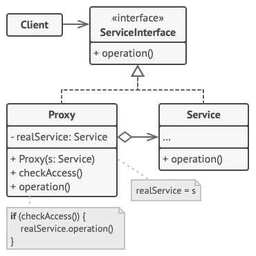
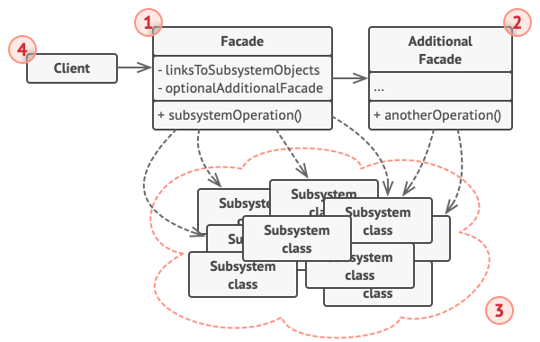
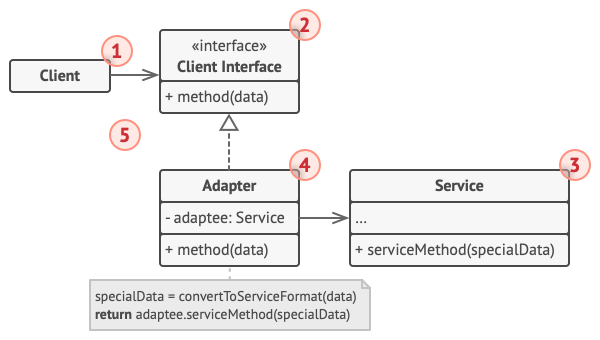
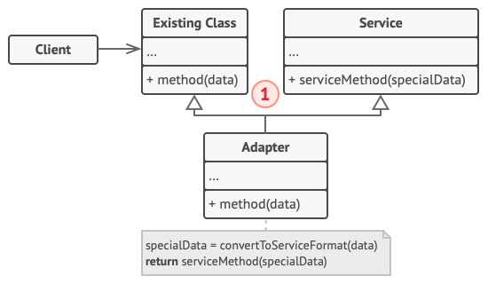
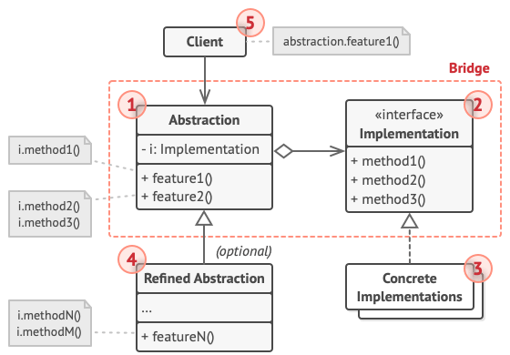
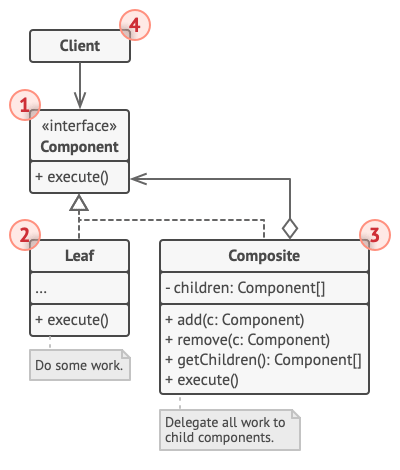
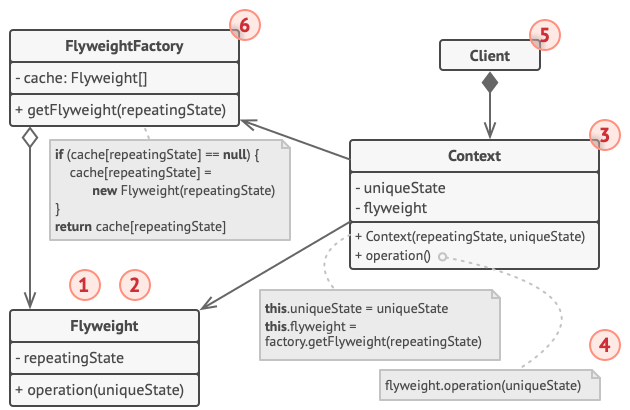

# Structural design patterns
Structural design patterns explain how to assemble objects and classes into larger structures, while keeping these structures flexible and efficient.

## Proxy
Structural design pattern that lets you provide a substitute or placeholder for another object.
(Also called Surrogate)

### About
- access control to original object
- effective access - caching, lazy loading (initialization)
- shares the same interface as the orginial object
- Doesn't change the object's core behavior, just manages access to it

### Example
- **President's press speaker:**
  - Controls media access to the president
  - Caches often repeated questions
  - Filters access
- **Credit card:** (Proxy to the bank account / physical cash)

### Structure

Client:
- should work with both services and proxies through the same interface.

Service Interface:
- declares the interface of the Service. The proxy must follow this interface to be able to disguise itself as a service object.

Proxy:
- maintaince a reference field that points to a service object
- passes the request to the service object
- usually manage the full lifecycle of their service objects.

Service:
- Class providing some useful business logic.

### Usage (Types of proxies)
- **Virtual Proxy (Lazy Initialization):** Placeholder for a heavy object; only initializes the real object when it's strictly needed.
- **Protection Proxy:** Access control to the object (checks permissions/roles before passing the request).
- **Remote Proxy:** Local representative to access a remote object over a network (e.g., ATM, gRPC, REST calls).
- **Cache Proxy:** Caches results of expensive operations to return them quickly for repeated requests.
- **Smart Reference / Logging Proxy:** Keeps track of who is accessing the object, logs requests, or frees up memory when no clients are using it.

### Advantages
- can improve performance (caching, lazy initialization)
- proxy can control and manage the service without client knowing it.
- improves security (access control)
- Open/Closed principle -> you can introduce new proxies without changing the service or client code

### Disadvantages
- another layer -> may increase code complexity
- the response might get delayed

### Related patterns
- Adapter
- Facade
- Decorator
More info [here](./Relations.md)

## Facade
Structural design pattern that provides a simplified interface to a library, a framework, or any other complex set of classes.

### Motivation
Complex system and the client logic is connected to many different complex subsystems -> simple higher-level unified interface

Different part are implemented in different classes

Main idea: hide the complexity of the whole system behind simpler interface, which connects needed sub-systems

### About
- subsystem doenst know about the facade
- handles ralationships and organization rather than behaviour
- solves tight coupling

### Example
Car has a *start button* - simple interface for the driver, but it conects mulitple subsystems -> ECU, sensors, starter, ignition, ...

### Structure
- **Facade (1):** - Provides simplified API
  - Coordinates subsystem classes
  - Access point to specific part of functionality
- **Additional Facade (2):** - Created to prevent polluting a single facade with unrelated features
- **Subsystem classes (3):** - Implements functionality
  - Independent of facade
  - Consists of dozens of various objects
- **Client (4):** - Uses Facade directly instead of many subsystems

### Usage
- if we have a complex subsystem
- to reduce coupling
- for layared architecture
- if we have old/complicated API
- Controller in MVC is sort of a facade

### Advantages
- code decomposition
- abstraction
- centralizes access point
- reduces coupling
- better readability
- dosnt stop from using subsystesm, just simplifies the access

### Disadvantages
- some overhead
- adittional code
- abstraction might become a bit tougher -> too abstract
- might become a "god code"

### Related patterns

#### Abstract factory 
- Alternative to Facade (to hide platform-specific classes)
- Can create objects inside the subsystem that the Facade needs

#### Singleton
- Also acts as the only access point 
- Facade is often a Singleton (e.g., database access, logger)

#### Adapter
Adapter is about compatibility, not making the usage simpler. Adapter ussually wraps just one object.
(its used for translation)
Facade can internally use an Adapter

#### Mediator
Both have similar jobs - organizing collaboration between lots of classes.
Mediator hides complexity between subsystems objects themselves, however the Facade hides the complexity from the client.

#### Proxy
Both buffers a complex eintity, however Proxy has the same interface as its service object, they are interchangeable

> [!NOTE]
> Facade should be used as a addition to the whole system and should not block usage of the complex use-case. Avoid making it a "god-code" - it should stay simple, without complex logic.

## Adapter 
Structural design pattern that allows objects with incompatible interfaces to collaborate.

### About
- converts the interface of one object so that another object can understand it
- doesnt change the funcionality
- 2 variants - object/class adapter
- two-way adapter is possible

### Example
- wall plug adapter
- data formats conversion (XML/JSON)
- unit conversion (imperial/meters)

### Object Adapter
Uses the object composition principle, the adapter implements the interface of one object and wraps the other one.
- more common

#### Structure

Client (1):
- class that contains the existing business logic of the program

Client Interface(2) (Target):
- describes a protocol that other classes must follow to be able to collaborate with the client code

Service(3) (Adaptee):
- some useful class (usually 3rd-party or legacy). The client can’t use this class directly because it has an incompatible interface.

Adapter(4):
- can work with both the client and the service
- it implements the client interface, while wrapping the service object.
- receives calls from client interface

#### Advantages
- better flexibility
- logic and API separation
- lower coupling
- easier tests -> mock

#### Disadvantages
- doesnt see protected methods and properties
- more wrapping code
- cant change the behaviour of Adaptee

### Class Adapter
- uses inheritance
- the adapter inherits interfaces from both objects at the same time
- (Note that this approach can only be implemented in programming languages that support multiple inheritance, such as C++)

#### Structure

Class adapter
- doesn’t need to wrap any objects, it inherits them
- adaptation happends within the overriden methods

#### Advantages
- can see protected method and properties and fields
- simplier to implement

#### Disadvantages
- diamond problem
- can hide current methods
- doestn work with sealed classes

### Usage
- integration library
- legacy code
- data formats convertion
- extern API wrapper/adaptation
- testing external service (mock)

### Related patterns
- Facade
- Decorator
- Bridge

## Bridge
Lets you split a large class or a set of closely related classes into two separate hierarchies—abstraction and implementation—which can be developed independently of each other.

### Motivation
post delivery -> multiple options -> so many classes

### About
- uses composition
- 2 hierarchies
- loosen the connection

### Example
- remote for TV, Radio
- multiplatform apps (using some framework)

### Structure
Abstraction(1)
- provides high-lavel control logic ()
- defines interface for client
- has pointer to implemtation

Implementation(2)
- declares the interface commond for all concrete implemtations.

Concrete implmentations(3)
- contains platform-specific code
- does the low-level work

Refined Abstractions(4)
- provides variants of control logic

Client(5)
- only want to see the abstractions, but he links the abstraction with one of the implementation objects

### Usage
- to divide and organize a monolithic code, which has serveral variants
- for class extentions in multiple directions
- for switching implementation during runtime
- UI frameworks
- gamedev - modifications
- database systems - for more types/variants

### Advantages
- better maintenance
- allows
- supports runtime modification
- Open-Closed Principle - new abstraction/implementation easily
- Single Responsibility Principle
- prevents code duplicatin

### Disadvantages
- complex for simple design - many classes
- complex from begging of the development

### Related patterns
- Adapter
- Abstract Factory
- Strategy
- Builder

## Composite
Structural design pattern that lets you compose objects into tree structures and then work with these structures as if they were individual objects.

### About
- tree-like structure
- hierarchical - leaves and nodes
- uses recursion
- can handle the object group same as one

### Example
- packages and orders -> calculate total price
- military structure

### Structure
Component(1)
- interface, which describes operation common to both simple and complex elements.

Leaf(2) 
- basic element of a tree, which doesnt have any sub-element
- usually do the most of the real work

Container(3) (Composite)
- has subelements
- doesnt know which type the chidren are, it uses just the commond interface
- delagates work to the children

Client(4)
- works with all elements throufh the interface 

### Usage
- when elements have tree structure
- UI elements
- file systems

### Advantages
- Open/Closed Principle - adding new elements easily
- client code simplification
- complex tree structures management is siplified using recursion

### Disadvantages
- can be too abstract/general (overgeneralized)
- common interface can be too complex
- child management may be complicated

### Related patterns
- Decorator
- Chain of Responsibility
- Visitor
- Iterator

## Decorator

## Flyweight
Structural design pattern that lets you fit more objects into the available amount of RAM by sharing common parts of state between multiple objects instead of keeping all of the data in each object.

### Motivation

### About
- some fields are identical across obejcts -> shared state
- unique extrinsic state - mutable
- repeating intristic state - immutable
- used for RAM optimalization

### Example
- particles in a game

### Structure
Flyweight (1, 2)
- contains part of the original objects state, which can be shared
- intristic (inside)
- extrubsuc (shared) 

Context (3)
- contains extristic state - unique across all original objects
- pair with flywight = complete original object

Flyweight Factory
- creates and manages pool of flyweights
- hadles sharing and access
Client
- uses references to flyweight objects

### Usage
- text editors
- game dev - decorations
- image on web pages
- UI - buttons, scrollbars, checkboxes
- only when your program must support a huge number of objects which barely fit into available RAM

### Advantages
- memory optimalization
- fewer object instances -> better performance
- scalability

### Disadvantages
- only for specific usage
- computing context requires CPU power (trading RAM for CPU)
- code becomes more complicated

### Related patterns

- Composite
- Facade
- Singleton
- State
- Strategy
