| [Overview](./README.md) | [Creational](./1Creational.md) | [Structural](./2Structural.md) | **Behavioral** | [Extended](./4Extended.md) | [Relations](./Relations.md)
| - | - | -| - | - | - |

# Behavioral
Behavioral design patterns are concerned with algorithms and the assignment of responsibilities between objects.

## State
behavioral design pattern that lets an object alter its behavior when its internal state changes. It appears as if the object changed its class.

### About
- related to the concept of a Finite-State Machine 
- specific behavior based on the specific state
- for finite number of states

### Example
- document - Draft/Moderation/Publish

### Structure

Context
- has a reference to ConcreteState
- outer interface for a client

State
- declaration of state-specific methods
- only methods for all states
- interface for every state

Concrete State
- implementation of state-specific metod

Client

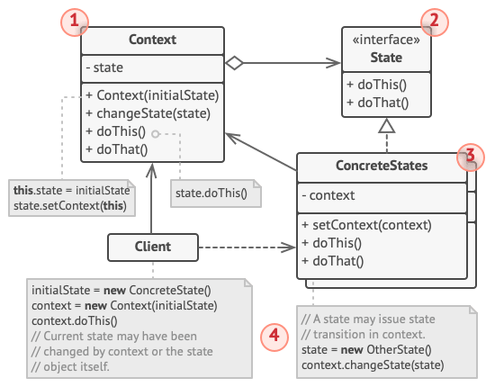

### Usage
- to replace a lot of if-else or switch
- to object with many states and 
- text editors
- graphic programs
- gamedev - states
- networking and protocols

### Advantages
- Single Responsible Principle - every state has its own calss
- Open/Closed Principle - adding new state doesnt require editing the existing one 
- simplier and clearer code

### Disadvantages
- overkill for few states
- can have nagative impact on performance

### Related patterns
- Singleton
- Flyweight
- Strategy
 - job delegation

## Memento
behavioral design pattern that lets you save and restore the previous state of an object without revealing the details of its implementation.

### About
- catches inner state
- implementataion using nested classes or interface

### Example
Text editor - undo -> how to recover prebvious state?

### Nested classes implementation
relies on support for nested classes, available in many popular programming languages (such as C++, C#, and Java).
the memento class is nested inside the originator. This lets the originator access the fields and methods of the memento, even though they’re declared private. On the other hand, the caretaker has very limited access to the memento’s fields and methods, which lets it store mementos in a stack but not tamper with their state.

#### Structure

Originator
- produce snapshots of its own state, as well as restore its state from snapshots when needed

Memento
- alue object that acts as a snapshot of the originator’s state. It’s a common practice to make the memento immutable and pass it the data only once, via the constructor.

Caretaker
- ows not only “when” and “why” to capture the originator’s state, but also when the state should be restored.
- can keep track of the originator’s history by storing a stack of mementos.

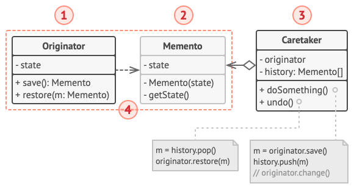

### Intermediate interface implementation
Alternative implementation
- suitable for programming languages that don’t support nested classes
- communication only through an explicitly declared intermediary interface,
- originators can work with a memento object directly, accessing fields and methods declared in the memento class -> all members must be public 

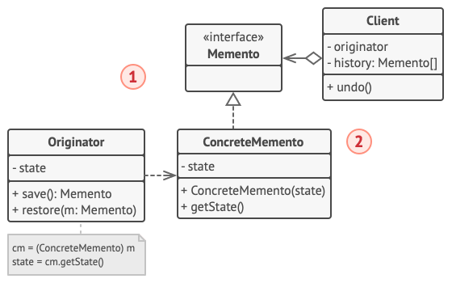

### Usage
- Undo/Redo
- keep object history
- text editors
- database transactions
- User Interface
- saving mechanism - game dev

### Advantages
- snapshots of state withouot violating its encapsulation
- simplification of the originators code

### Disadvantages
- may be costly
- need to destroy obsolete mementos
- dynamic language - PHP, Python, Javascript - cant guarantee taht the state within the memento stays untouched

### Related patterns
- Command
- Iterator
- Prototype

## Iterator
Behavioral design pattern that lets you traverse elements of a collection without exposing its underlying representation (list, stack, tree, etc.).

### About
- unified interface to sequential access to collection elemnts
- no need to show inner
- interface
    - First()
    - Next()
    - IsDone()
    - CurrentItem()

### Structure
Iterator 
- declares the operations required for traversing a collection
- next, current, restart

ConcreteIterator
- implement specific algorithms for traversing a collection

Collection
- declares one or multiple methods for getting iterators compatible with the collection.

ConcreteCollection
- new instances of a particular concrete iterator class each time the client requests one. 

Client
- works with both collections and iterators via their interfaces. 

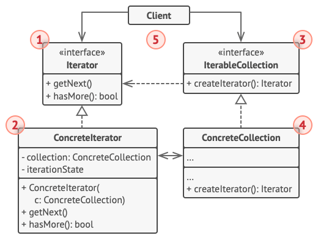

### Usage
- in OOP oriented languages
- in guts of Foerach
- Use the pattern to reduce duplication of the traversal code across your app.
-  Use the pattern to reduce duplication of the traversal code across your app.

### Advantages
- Single Responsibility Principle - traversal algorithm
- Open/Closed Principle - new collection types and iterators
- iteration can be done in parallel
- iteration can be delayed

### Disadvantages
- can be overkill for simple collections
- may be less efficeint for some specialized collection than direct access

### Related patterns
- Factory method
- Composite
- Memento
- Visitor

## Command
behavioral design pattern that turns a request into a stand-alone object that contains all information about the request.

### Motivation
text-editor app, we want to create a toolbar with several buttons

### About
- allows to pass requests as a method arguments
- or delay or queue a request’s execution
- support undoable operations.
- also called Action/Transaction

### Structure

Invoker (sender)
- runs the individual commands
- responsible for initiating requests 

Command
- defines common interface for all commands

Concrete Commands
- concrete implementation
- pair - action + who can do it
- calls receiver

Receiver
- do the command itself
- in some cases can be missing

Client
- creates concrete commands

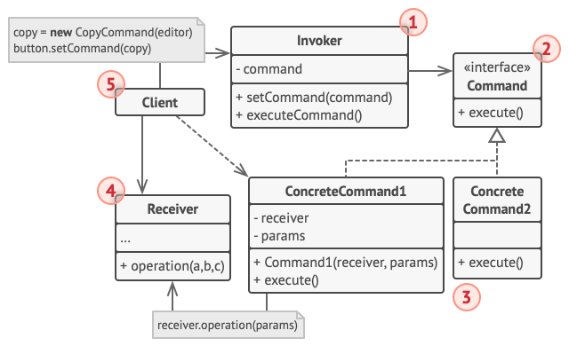

### Usage
- to parametrize objevts with operations
- to queue operations, schedule, etc ...
- for reversible operations

### Advantages
- undo/redo support
- macro
- better testability
- Single Responsibility Principle 
- Open/Closed Principle - new command easily
- speration of inovker and receiver
- can assamble complex command from simple ones

### Disadvantages
- many objects and classes
- more memory needed
- can be useless for small operations

### Related patterns

- Memento

- Composite
- Factory
- Prototype

## Interpreter
Provides way to evaluate language grammar or expression

### About
- tree structure
- defines grammar
- only DP, which is woth for smaller projects, but mess for larger ones

### Example
- Postfix calculator
- regular expressions
- date conversion

### Structure

Client
- gets/creates AST
- calls interpret()

Context
- global info

Abstract Expression
- declared abstract method interpret()

Concrete Expression
- implementation of interpret()

### Usage
- compilators
- parsers
- Query languages (SQL)
- units conversions

### Advantages
- simple implementation
- easily extendable
- rules readability

### Disadvantages
- complexity for bigger grammars
- low performance
- hard to maintain

### Related patterns
- Composite
- Visitor
- Iterator

## Chain of Responsibility
behavioral design pattern that lets you pass requests along a chain of handlers. Upon receiving a request, each handler decides either to process the request or to pass it to the next handler in the chain.

### Motivation
Building permision 

### About
- passes commands in a chain
- every handler can decide
-> lowers coupling between sender and handler
- process can be stopped in the middle
- if needs to execute handlers in particular order

### Example
- airport

### Structure
Handler
- declares the interface, common for all concrete handlers
- usually just a single method to set the next handler

Base Handler
- optional class where you can put the boilerplate code that’s common to all handler classes.

Concrete Handler
- actual code for processing requests
-  each handler must decide whether to process it and, additionally, whether to pass it along the chain

Client
- may compose chains just once or compose them dynamically
- request can be sent to any handler in the chain

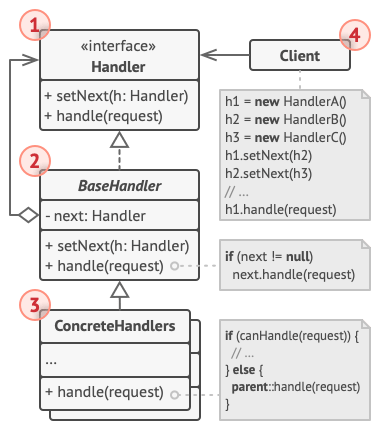

### Usage
- web application -> middleware
- GUI frameworks - user events
- Logging
- security process - autentication, authorization

### Advantages
- client and receiver separation
- sending is simplier for the client
- the chain can be changes during evaluation
- you can control order of handling
- Single responsibility Principle
- Open/Closed principle

### Disadvantages
- the request can get lost
- all handlers can decide to refuse it 

### Related patterns
- Composite
- Command
- Decorator

## Observer 
Behavioral design pattern that lets you define a subscription mechanism to notify multiple objects about any events that happen to the object they’re observing.

### About
- one publisher to many observers/sibscibers
- use when some objects must observe others
- push or pull model

### Example
- train time table
- newspapers and publisher

### Structure
Publisher
- issues events to other objects
- has subscription infrastructure 
- subscription list  

Subscriber
- defines the notification interface
- usually single Update method

Concrete Subsribers
- performs some action
- must implement same interface

Client
- creates publisher and subscriber

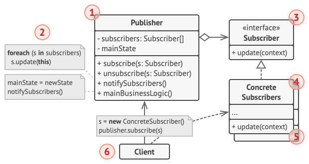

### Usage
- GUI event handling
- real-time dashboards
- game system - achievements, quest log, sound analytics
- messeaging, notifications -> chat room, subsription feed

### Advantages
- Open/Closed principle -> new subsciber easily
- can change relations at runtime
- low coupling
- kinda broadcasting

### Disadvantages
- subscribers are notified in random order
- flooding

### Related patterns
- Mediator
- Singleton

## Mediator

behavioral design pattern that lets you reduce chaotic dependencies between objects.

### About
- objects communicatitaon via the mediator, not directly
- objectas doesnt know about each others
- encapsulates the communication between objects
- for tightly coupled classes

### Example
- airports and towers
- chatroom

### Structure
Components
- classes with bussiness logic
- each has reference to a mediator (via interface)

Abstract Mediator
- declares methods of communication with components

Concrete Mediator
- encapsulates relation between components
- often keep references to all components they manage

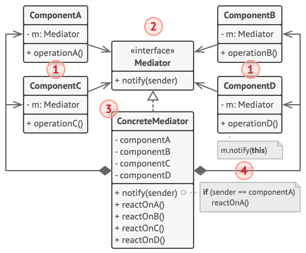

### Usage
- GUI interactions - 
- Chatrooms
- Logging

### Advantages
- Single Responsibility Principle - communication is on single place
- Open-Closed principle - new mediators
- reduces coupling
- better code/components resusage

### Disadvantages
- perfmormance bottleneck
- "god-like" object can be created easily 

### Related patterns
- Facade
- Observer
- Broker

## Strategy
Behavioral design pattern that lets you define a family of algorithms, put each of them into a separate class, and make their objects interchangeable.

### About
- for replacable/interchangable algorithms
- for family of algorithms
- switch can be done at runtime
- replace huge if statements with different variants

### Example
- Multiplatform file manager 
- navigation app
- transportaion from airport

### Structure

Context
- maintains a reference to one of the strategies

Strategy
- iterface common for all concrete strategies

Concrete Strateies
- implements different variations

Client
- creates specific strategy and passes it to the context 

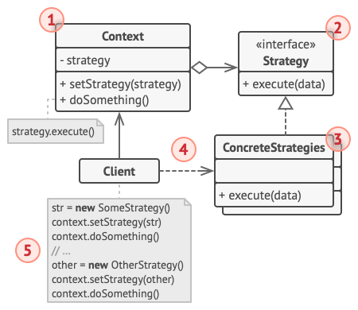

### Usage
- serialization
- Routing/ paths
- GUI
- payments
- logging

### Advantages
- Open/Closed Principle
- testability
- more independent strategies
- algorithm can change at runtime
- hiding implementation details

### Disadvantages
- code can get complicated
- client has to know strategies and its differencies
- overhead in the communication
- overkill for simple app with few algorithms that barely changes 
- modern Prog.Langs. have functional type support with anonymous functions

### Related patterns
- Command
- State
- Template Method

## Template Method
behavioral design pattern that defines the skeleton of an algorithm in the superclass but lets subclasses override specific steps of the algorithm without changing its structure.

### Motivation
App that extract data from files with different formats - docx, csv, pdf

### About
- break down an algorithm into a series of steps, turn these steps into methods
- use for editing only particular steps of an algorithm
- removes duplicated code

### Example
- NPC in some game
- building a house step by step

### Structure
Abstract class
- defines methods (steps) - hooks
- algorithm skeleton (Template Method)

Concrete class
- specific implementation
- part of the algorithm
- can override the steps

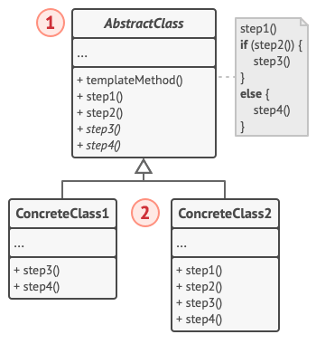

### Usage
- unit testing frameworks - JUnit, unittest
- web servers - Django, Ruby on Rail
- Graphic interface
- gamedev - entities lifecycle

### Advantages
- clients can change only specific part of the algorithm
- the duplicate code can be moved to superclass

### Disadvantages
- might violate the Liskov Substitution Principle
- template methods tend to be harder to maintain

### Related patterns
- Factory Method
- Strategy

## Visitor
Behavioral design pattern that lets you separate algorithms from the objects on which they operate.

### Motivation

### Example
- Geometry export
- insurance agent who’s eager to get new customers. He can visit every building in a neighborhood - different insurance based on the type

### About
- allows to define new operations for existing structure of objects
- separate algorithm of visit from visited objects
- single dispatch or double dispatch
- if you need to perform an operation on all elements of a complex object structure (for example, an object tree).

### Structure
Visitor
- interface, which declares a set of visiting methods

Concrete Visitor
- implements several versions

Element
- declares a method for “accepting” visitors

Concrete Element
- must implement the acceptance method. 

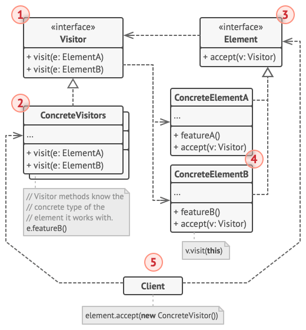

### Usage
- compilators - AST operations
- static analysis
- serialization
- UI frameworks
- game engines
- filesystem access

### Advantages
- Open/Closed principle
- Single Responsibility principle
- type safe
- visitor can accumulate information

### Disadvantages
- can break encapsulation
- need to update all visitor, if new class created 
    -> trade-off - new types vs new funcionality
### Related patterns
- Iterator
- Composit
- Interpret

| [Overview](./README.md) | [Creational](./1Creational.md) | [Structural](./2Structural.md) | **Behavioral** | [Extended](./4Extended.md) | [Relations](./Relations.md)
| - | - | -| - | - | - |