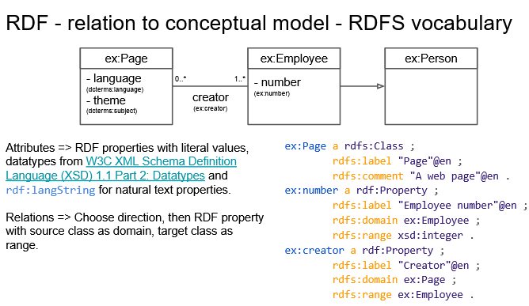

# RDFS (RDF Schema 1.1.)
- W3C Recommendation
- 25 February 2014
- Vocabulary for creation of other RDF vocabularies
- Functionally different from other schema languages, e.g. XML Schema
- RDF is “schema-less” - does not restrict the logical schema of the data and any RDF triple can be stored in the triplestore.
- Some are explained by usage of classes and properties defined by RDFS.

## RDF Vocabulary 
Collection of classes and properties, their IRIs and their definitions

## Class
Class is a resource with its IRI. This resource is of a type rdfs:Class - saying it is a class and can be used as a class for other resources.  
Class also represents a set of all resources of this type.  
rdfs:subClassOf defines a subtype - and also can be viewed as a simple subset with all implications.

Definition of a class:
- rdfs:Class
- rdfs:subClassOf 

```
ex:MotorVehicle       rdf:type          rdfs:Class .
ex:PassengerVehicle   rdfs:subClassOf   ex:MotorVehicle .
```

## Defining properties
Big difference between RDFS and object-oriented programming (OOP): 
RDF properties are first class citizens.
They can exist on their own, independently of any class.
- rdf:Property
- rdfs:subPropertyOf = Properties can also form hierarchies


```
ex:driver          a             rdf:Property .
ex:primaryDriver   a             rdf:Property .
ex:primaryDriver   rdfs:subPropertyOf   ex:driver .

```

Every class and property should have a label and comment - this is the base for any RDF vocabulary.

## Label
rdfs:label = Human readable name of a resource

## Comment
rdfs:comment = Longer description of a resource

## seeAlso
rdfs:seeAlso = Points to a resource that might provide more information about the subject resource

## isDefinedBy
rdfs:isDefinedBy - In a sense not specified by RDF


## RDF Model

### rdf:List
- For closed collection

Normally, RDF triples in the RDF model do not have an order specified, because the RDF model is a set.  
In cases when we need to specify order of resources, we use an rdf:List.  
-> RDF representation of the well-known linked list data structure.  
Note that the list is closed by rdf:nil, i.e. adding to the list requires changing pre-existing data.

In RDF Turtle, there is a syntactic shortcut representing rdf:List “( )” (see later)
```
# the value of this triple is the RDF collection blank node
:subject :predicate ( :a :b :c ) .

# an empty collection value - rdf:nil
:subject :predicate2 () .
```

### Open collections
- not used frequently  

the collections are open, i.e. one can add to them without changing pre-existing data.  
Uses a set of special predicates from the rdf namespace (_1, _2, …)

#### rdf:Bag
Set - ordering does not matter (even if specified). 

#### rdf:Seq
Sequence - ordering matters - should be interpreted by applications working with the data

#### rdf:Alt
the items are alternatives - only one should be chosen (e.g. by the user working with an application working with the data).


### Relations

Relations => Choose direction, then RDF property with source class as domain, target class as range.

```
ex:Page a rdfs:Class ;
        rdfs:label "Page"@en ;
        rdfs:comment "A web page"@en .
ex:number a rdf:Property ;
        rdfs:label "Employee number"@en ;
        rdfs:domain ex:Employee ;
        rdfs:range xsd:integer .
ex:creator a rdf:Property ;
        rdfs:label "Creator"@en ;
        rdfs:domain ex:Page ;
        rdfs:range ex:Employee .
```

## Open World Assumption (OWA)
Assumption that the truth value of a statement may be true irrespective of whether or not it is known to be true

```
Statement: "Mary" "is a citizen of" "France"
Question: Is Paul a citizen of France?

"Closed world" (for example SQL) answer: No.
"Open world" answer: Unknown.
```

The absence of a statement does not mean the statement is false.
It simply means we don’t know.