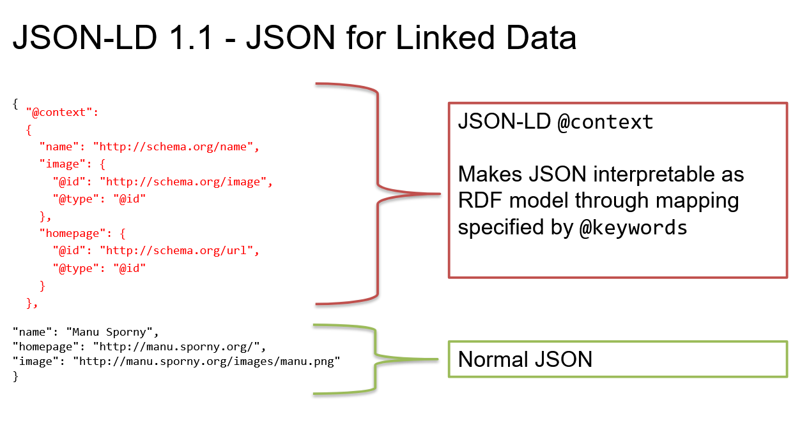

# JSON Schema
https://json-schema.org/
- Proposed IETF/ECMA standard  
“JSON Schema is a vocabulary that allows you to annotate
Roles:  
- annotation - describing the structure for people (title, description)
- validation - constraining the structure for machines (type)  
First proposal: 2007  
Still under development, currently 2020-12  

```
{
    $schema": "https://json-schema.org/draft/2020-12/schema",
    "$id": "http://example.com/product.schema.json",
    "title": "Product",
    "description": "A product in the catalog",
    "type": "object"
}
```

## Properties

```
"properties": {
      "productId": {
        "description": "The unique identifier for a product",
        "type": "integer"
      },
      "productName": {
        "description": "Name of the product",
        "type": "string"
      }
    },
    "required": [ "productId", "productName" ]
```

## Numerical constraints
Validation keywords for numeric instances
- multipleOf
- maximum, exclusiveMaximum
- minimum, exclusiveMinimum


## Arrays
Validation keywords for arrays - list validation    
- items, maxItems, minItems  
- contains, maxContains, minContains  
- uniqueItems  


items - items schema must be valid for every item  
contains - one or more items must be valid, maxContains, minContains


```
{
  "type": "array",
  "items": [
    { "type": "number" },  // First must be number
    { "type": "number" },  // Second must be number
    { "type": "string" }   // Third must be string
  ],
  "minItems": 3,
  "additionalItems": false
}
```


## String contraints 
Length
```
{
    "type": "string",
    "minLength": 2,
    "maxLength": 3
}

```

Regular expression
```
{
    "type": "string",
    "pattern": "^(\\([0-9]{3}\\))?[0-9]{3}-[0-9]{4}$"
}
```

## Formats
built-in formats for strings
- date-time, date, time, duration
- email, idn-email
- hostname, idn-hostname
- ipv4, ipv6
- uri, uri-reference
- iri, iri-reference
- uuid
- uri-template
- json-pointer, relative-json-pointer
- regex

```
"typ_turistického_cíle": {
    "type": "string",
    "format": "iri",
    "pattern": "^https\\://data\\.dia\\.gov\\.cz/zdroj/číselníky/typy-turistických-cílů/položky/.*$",
    "title": "Typ turistického cíle",
    "examples": [ 
        "https://data.dia.gov.cz/zdroj/číselníky/typy-turistických-cílů/položky/přírodní"
    ]
}
```

### Boolean
```
{ "type": "boolean" }

```

### Null
```
{ "type": "null" }

```

### Combining schemas
Schemas can be combined:
- anyOf
    - valid against at least one schema
- allOf
    - valid against all schemas
    - can be used for extending schemas
- oneOf
    - valid against exactly one schema
- not
    - valid against none of the schemas

```
"anyOf": [
    { "type": "string", "maxLength": 5 },
    { "type": "number", "minimum": 0 }
]
```

### Validator
https://www.jsonschemavalidator.net/  
https://tryjsonschematypes.appspot.com/#validate

## JSON-LD
JSON for Linked Data  
Goal of JSON-LD is to satisfy both JSON and RDF oriented developers.

JSON-LD @context -> Makes JSON interpretable as an RDF data model by mapping terms and keywords to IRIs.  

RDF oriented developers can load a JSON-LD file just as any other RDF serialization
JSON oriented developers can ignore @context and work with the rest of the file as with a regular JSON file  

JSON-LD 1.1 - W3C Recommendation
- 16 July 2020
- playground: https://json-ld.org/playground/

```
{
  "@context":
  {
    "name": "http://schema.org/name",
    "image": {
      "@id": "http://schema.org/image",
      "@type": "@id"
    },
    "homepage": {
      "@id": "http://schema.org/url",
      "@type": "@id"
    }
  },
    "name": "Manu Sporny",
    "homepage": "http://manu.sporny.org/",
    "image": "http://manu.sporny.org/images/manu.png"
}


```

### Keywords
- @context
- @id - subject identifier (IRI)
- @language
- @type - type/class identifier
- @vocab - default vocabulary
- @base - base IRI 
- @reverse - reverse direction like parent-children relationship
- @graph - grouping of nodes (can represent named graphs when combined with @id)

### ID
Purpose of @id is to assign an IRI to a node (RDF subject)  
- subject identifier (IRI)

```
{
  "@context":
  {
    ...
    "name": "http://schema.org/name"
  },
  "@id": "http://me.markus-lanthaler.com/",
  "name": "Markus Lanthaler",
  ...
}

```

### Type
@type - specifies class IRI
It can be an array - specifying multiple types/classes
```
{
...
  "@id": "http://example.org/places#BrewEats",
  "@type": "http://schema.org/Restaurant",
...
}

{
...
  "@id": "http://example.org/places#BrewEats",
  "@type": [ "http://schema.org/Restaurant", "http://schema.org/Brewery" ],
...
}
```

### Keyword aliasing
For hardcore JSON developers, who do not want to see an “@keywords” in “their normal JSON” file, keywords can also be aliased - renamed - in the @context.

```
{
  "@context":
  {
     "url": "@id",
     "type": "@type",
     "Person": "http://xmlns.com/foaf/0.1/Person",
     "name": "http://xmlns.com/foaf/0.1/name"
  },
  "url": "http://example.com/about#gregg",
  "type": "Person",
  "name": "Gregg Kellogg"
}
```

### Multiple values
- JSON Array has ordering defined.
- However, without further specification, this is translated into regular multiple RDF values, i.e. unordered
- If we want to preserve the ordering, we need to use the “@list” keyword

```
{
...
  "@id": "http://example.org/people#joebob",
  "nick": [ "joe", "bob", "JB" ],
...
}
{
...
  "@id": "http://example.org/people#joebob",
  "nick":
  {
    "@list": [ "joe", "bob", "jaybee" ]
  },
...
}
```

### 3 Ways how to add context

#### Regular
Using @context keyword and section before normal JSON part
```
{
  "@context":
  {
    "name": "http://schema.org/name",
    "image": {
      "@id": "http://schema.org/image",
      "@type": "@id"
    },
    "homepage": {
      "@id": "http://schema.org/url",
      "@type": "@id"
    }
  },
    "name": "Manu Sporny",
    "homepage": "http://manu.sporny.org/",
    "image": "http://manu.sporny.org/images/manu.png"
}

```


#### External
For hardcore JSON developers, who do not want to see an “@keywords” in “their normal JSON” file, keywords can also be aliased - renamed - in the @context.

```
{
  "@context": "https://example.org/context.jsonld",
  "url": "http://example.com/about#gregg",
  "type": "Person",
  "name": "Gregg Kellogg"
}
```

#### Using HTTP header
And for the most hardcore JSON developers (or if it is simply impossible to add the “@context” key into the JSON file) the JSON @context can be added completely externally, using HTTP headers while serving the plain JSON content.

```
GET /ordinary-json-document.json HTTP/1.1
Host: example.com
Accept: application/ld+json,application/json,*/*;q=0.1

====================================

HTTP/1.1 200 OK
...
Content-Type: application/json
Link: <http://json-ld.org/contexts/person.jsonld>; rel="http://www.w3.org/ns/json-ld#context"; type="application/ld+json"

{
  "name": "Markus Lanthaler",
  "homepage": "http://www.markus-lanthaler.com/",
  "image": "http://twitter.com/account/profile_image/markuslanthaler"
}
```

### Usage 
Amazon Alexa